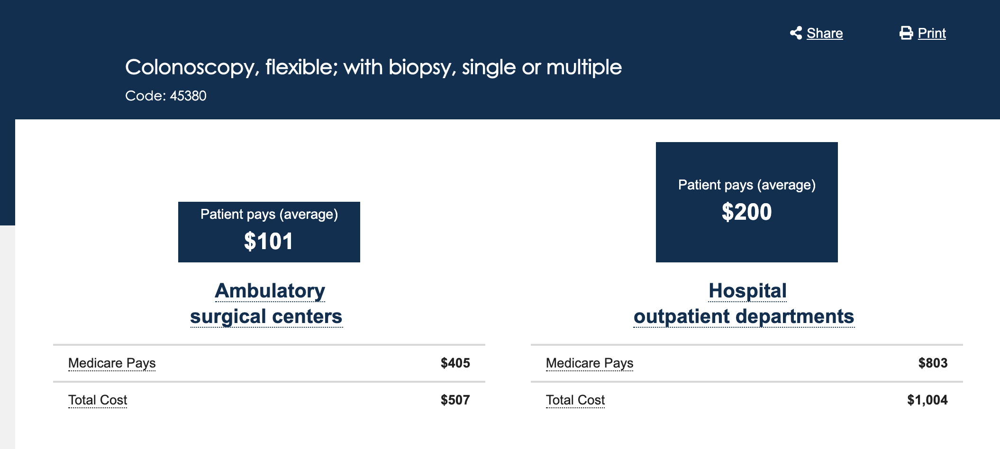
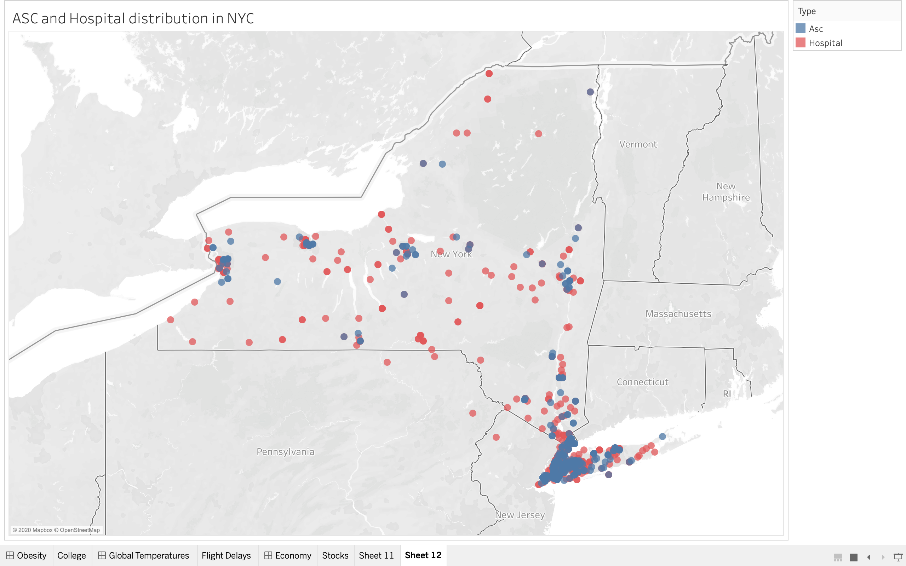

# Provider Network Site of Care

##Abstract

If someone would like to take a colonoscopy, there is a $497 cost difference between __Acute general hospital__ and __Ambulatory surgery Center(ASC)__.
So insurance company may consider sending patients to nearby ASC instead of hospitals in order to reduce the cost.
Thus,To build a provider network for site of care about colonoscopy is of importance. The general idea is that I would like to find for each __Acute General Hospital__ in NY state, how many __Ambulatory surgery Center__ are nearby and suggest the insurance company to send the patients who planned to go to the hospital for colonoscopy to nearby Ambulatory surgery Center. 

##Data Source

[Full Replacement Monthly NPI Files](https://download.cms.gov/nppes/NPI_Files.html)

## Requirements:

There are some general library requirements for the project, which are as follows.

- sparklyr
- DBI
- tidyverse

##Methods

There are softwares that will be used: 

- R : Large dataset process with Spark in R
- SAS : Geocoding
- Tableau : Visualization

__*1.Extract the taxonomy code of acuate general hospital and ASC*__

Taxonomy code are designed to categorize the type, classification, and/or specialization of health care providers. 

__*2.Geocode the providers by street info*__

__*3.filter the hospital and asc connect with distance smaller than 15 mile*__

The __distance.xlsx__ in data is the final result which can also help check the accessbility of colonoscopy in NY state. 

##Result

